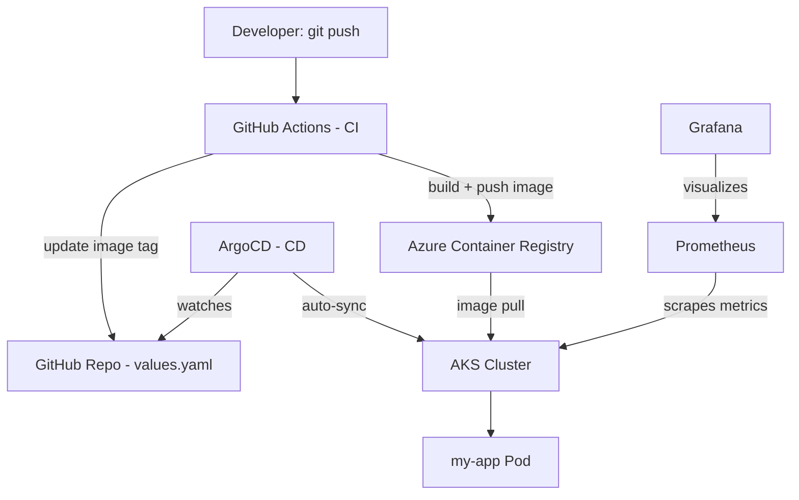

# Azure GitOps Platform

A production-style cloud-native platform built to apply my Azure (AZ-104), Kubernetes (CKA), and Terraform Associate certifications in an end-to-end, real-world scenario — not just isolated exam exercises.

**Author:** Yavuz Selim Gazi
[LinkedIn](https://linkedin.com/in/yavuzselimgazi) · [GitHub](https://github.com/yavuzselimgazi)

---

## What This Demonstrates

- **Infrastructure as Code** with Terraform (AKS, networking, container registry, remote state)
- **Kubernetes application deployment** via a Helm chart written from scratch
- **CI/CD** with GitHub Actions, authenticated to Azure via OIDC (no stored secrets)
- **GitOps** with ArgoCD — Git is the single source of truth; the cluster self-syncs
- **Observability** with Prometheus and Grafana
- Real, unplanned incidents debugged and documented (see below)

---

## Architecture



**Flow:** Terraform provisions the infrastructure once. After that, pushing code is the only manual step — GitHub Actions builds and pushes the image, updates the Helm values, and ArgoCD detects the Git change and syncs the cluster automatically. No manual `kubectl apply` or `helm upgrade` is needed for application changes.

---

## Tech Stack

| Layer | Tool | Why |
|---|---|---|
| Infrastructure | Terraform | Reproducible, version-controlled Azure resources |
| Container Orchestration | AKS (Kubernetes) | Industry-standard container platform |
| Container Registry | Azure Container Registry | Native Azure integration, RBAC-based access |
| CI | GitHub Actions | Build, test, and push automation |
| Authentication | OIDC (federated identity) | No long-lived secrets stored in GitHub |
| Packaging | Helm | Written from scratch for `my-app` to demonstrate templating understanding |
| GitOps / CD | ArgoCD | Official Helm chart — an ecosystem tool, not reinvented |
| Observability | kube-prometheus-stack | Official Helm chart — Prometheus + Grafana + Alertmanager |

**Note on Helm usage:** My own application (`my-app`) uses a Helm chart written entirely from scratch, so I can explain every line. ArgoCD and the Prometheus stack use official, community-maintained charts — these are general-purpose infrastructure tools, not my application logic, so reimplementing them would add risk without adding value.

---

## Repository Structure

```
azure-gitops-platform/
├── infra/                  # Terraform: AKS, networking, ACR, OIDC, remote state
├── charts/my-app/          # Hand-written Helm chart for the sample app
├── app/                    # Python HTTP app + Dockerfile
├── manifests/argocd-apps/  # ArgoCD Application definitions
└── .github/workflows/      # CI pipeline (build, push, update values.yaml)
```

---

## How to Run This

```bash
# 1. Provision infrastructure
cd infra
terraform init
terraform apply

# 2. Connect kubectl to the new cluster
az aks get-credentials --resource-group rg-gitops-platform --name aks-gitops-platform

# 3. Install ArgoCD and the monitoring stack
helm install argocd argo/argo-cd --namespace argocd --create-namespace
helm install prometheus prometheus-community/kube-prometheus-stack --namespace monitoring --create-namespace

# 4. Point ArgoCD at this repo
kubectl apply -f manifests/argocd-apps/my-app.yaml
```

From here, any push to `app/` is automatically built, pushed, and deployed — no manual steps required.

---

## Incident Log

### 1. CrashLoopBackOff — Missing `serve_forever()` call

**Symptom:** After ArgoCD's first automated sync, the pod entered `CrashLoopBackOff`.

**Diagnosis:** `kubectl describe pod` showed the container exiting with code `0` ("Completed") shortly after starting — unusual for a Deployment, which expects a long-running process.

**Root cause:** The Python HTTP server created the server object and printed a startup message, but never called `server.serve_forever()`. The script simply reached the end of `main` and exited cleanly, which Kubernetes interpreted as a crash-and-restart cycle.

**Fix:** Added the missing `serve_forever()` call, committed, and pushed. The full pipeline (GitHub Actions → ACR → ArgoCD) resynced automatically — no manual intervention.

**Lesson:** In Kubernetes, exit code `0` doesn't mean "healthy" for a long-running service — an unexpected clean exit is itself the bug.

### 2. Git non-fast-forward — race condition with the CI bot

**Symptom:** A local commit was rejected on `git push` with `non-fast-forward`.

**Diagnosis:** GitHub Actions had already pushed its own commit (updating the image tag in `values.yaml`) between my last pull and my push — a classic race condition between a human and a bot writing to the same branch.

**Fix:** `git pull` to integrate the bot's commit, then push again.

**Lesson:** Files that CI manages automatically (like `values.yaml`'s image tag) shouldn't be hand-edited. In a real team setting, I'd add branch protection and a mandatory pull-before-push habit — or move to a dedicated GitOps repo separate from application source, which is the more common production pattern.

---

## What I'd Add Next

- HashiCorp Vault or Azure Key Vault CSI driver for secret management
- CKS-style security hardening (network policies, pod security standards)
- Multi-environment setup (dev/staging/prod) via Kustomize overlays on top of this Helm chart
- Horizontal Pod Autoscaler based on Prometheus custom metrics